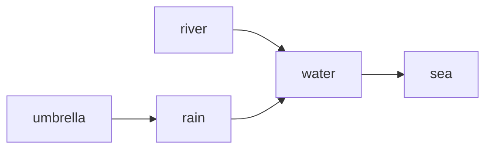
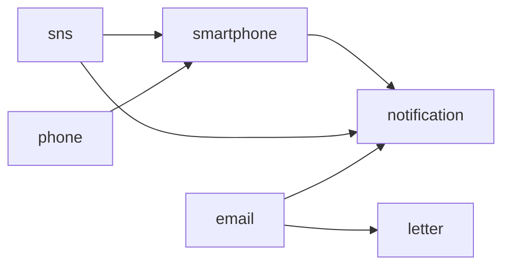
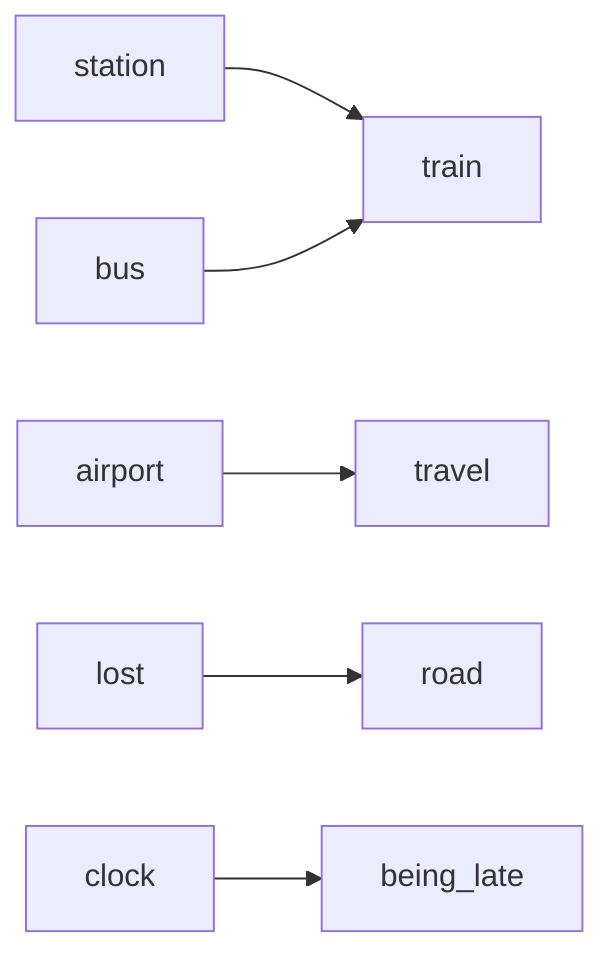

# Stage7 Relation Review

Stage7は `batch-05` を追加する前の relation / warning 整理フェーズです。80モチーフ時点の relation を棚卸しし、100モチーフへ進む前にレビュー可能な分類へ寄せます。

## Diagnostic Baseline

Stage6完了後のproduction registry診断は次の状態です。

| severity | count | Stage7での扱い |
|---|---:|---|
| error | 0 | 必ず0を維持 |
| warning-fix-soon | 189 | 189以下を維持 |
| warning-review-ok | 26 | 理由付きでdocs管理 |
| info | 125 | 分類済み/未分類を区別 |

`info` 125件の内訳は、`one-way-relation` が122件、同一motif内のalias重複infoが3件です。Stage7のrelation分類対象は one-way relation 122件と、warning-review-okのone-way conflict 5件を合わせた127件です。

## Classification Result

| 分類 | 件数 | 扱い |
|---|---:|---|
| intentional-one-way | 9 | 片方向で意味が成立するため維持候補 |
| should-be-reciprocal | 31 | 双方向neighbor化を検討する候補 |
| should-be-conflict | 2 | 抑制関係にすべきか確認する候補 |
| generic-specific | 26 | 汎用/具体の優先関係としてレビュー |
| context-helper | 59 | 文脈補助として片方向維持候補 |
| stale-relation | 0 | Stage7時点で削除候補なし |

未分類relationは0件です。件数削減より、全件をレビュー可能な状態にすることを優先しています。

## Cluster Result

| クラスタ | 件数 |
|---|---:|
| water-weather | 20 |
| home-place | 15 |
| movement | 23 |
| communication | 13 |
| relationship | 18 |
| body-appearance | 13 |
| emotion-action | 7 |
| nature-sky | 10 |
| object-record | 5 |
| care-risk | 0 |
| general | 3 |

優先クラスタは、高頻度、既存fixture登場、warning-review-okとの関係を基準にしています。Stage7では `movement`、`water-weather`、`communication`、`relationship`、`body-appearance` を重点レビュー対象にします。

## Review Policy

- 機械的な双方向化はしない
- `conflicts` は抑制、`neighbors` は併存と順位補助に限定する
- generic/specific は `conflicts` またはspecific優先として扱う
- near-neighbor は原則として併存させる
- context-helper は片方向relationとして許容する

## Minimal Visualization

## Stage7 Completion Gate

- production registryの `error` が0
- `warning-fix-soon` が189以下
- one-way relation diagnostics 127件が分類済み
- info 125件のうちrelation infoとalias infoを区別できる
- batch-05候補は整理までで、本実装には入らない
